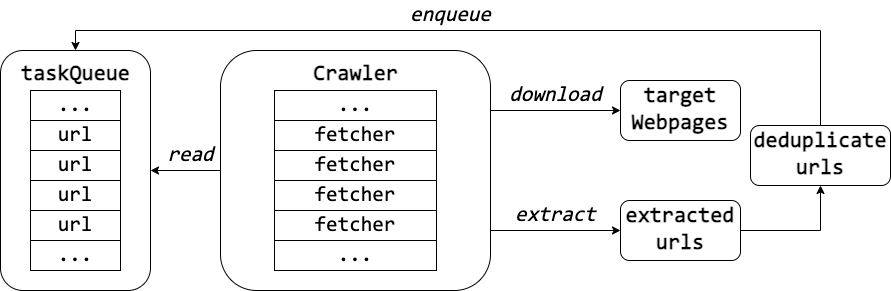

# spider-go
Concurrent web crawler implemented by Golang.

## Architecture

- Crawler: dispatch tasks
- fetcher: take task and perform `http.Get`, `Extract`, `Download` and `Enqueue`



## Usage
```shell script
> go build -o spider              # Compile
> ./spider -h                     # /help
> ./spider -c ../conf/spider.conf # run your spider
```
## TODO

- Make it `distributed`
- Auto terminated